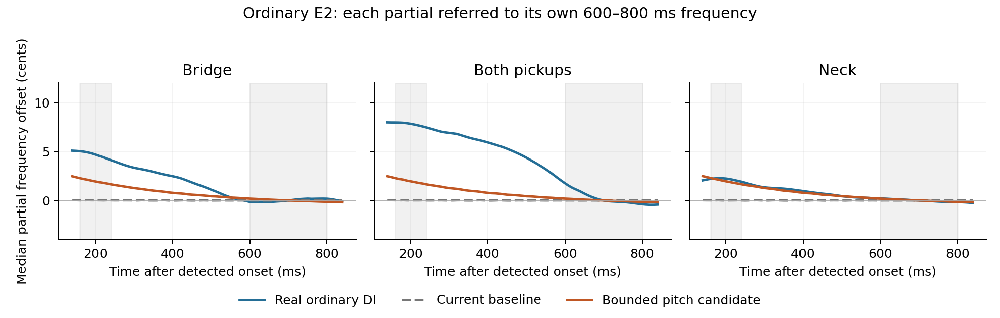

# Ordinary picked-note reference check — 11 September 2026

Real notes continue to change after the pick has left the string. This pass
isolates one such cue: the fundamental and several harmonics relaxing together
from a slightly higher initial pitch. It uses original PCM recordings, with
independent partial tracking, to distinguish actual pitch motion from the
apparent change produced when bright harmonics simply decay faster.

## Source and scope

The [EG-IPT deposit](https://zenodo.org/records/15205644), by Marco Fiorini,
Nicolas Brochec, Joakim Borg and Riccardo Pasini, provides ordinary picked notes
from a 2005 Gibson SG Standard. Its DI path uses a BSS AR-133 and Midas XL48;
the published recordings are 96 kHz, 24 bit. The official deposit's API confirms
CC BY 4.0. This pass fetched only the three `ordinario`, `DI`, sixth-string
files with literal note identifier `02`, retaining the previous source cohort.
The identifier is not a proven fret number. These are separately played takes,
not simultaneous observations of one stroke through different pickups.

The [range downloader](../Experiments/RealismReference20260911/download_egipt.py)
read 29,763,544 bytes in 16 requests, about 0.1253% of the complete
23,757,983,313-byte ZIP. It verifies each HTTP Content-Range and ZIP CRC. Exact
member names, source URLs and hashes are retained in the
[provenance receipt](../Experiments/RealismReference20260911/provenance.json).
No third-party audio is included in the instrument or committed to this repo.
The local recordings remain in `build-realism-20260911/reference/`.

Two original-PCM `Natural` files from
[James Stubbs's GPL-3.0 8ridgelite repository](https://github.com/JamesStubbsEng/8ridgelite)
provide a separately reported extended-range direction check. Their E1/E2 WAV
hashes exactly match the previous research. The files contain two unnamed
channels; each is analyzed separately. The guitar model, tuning, physical
string/fret, picking force and recording chain are undocumented. They cannot
identify an eight-string construction or force coefficient. Neither source is
new holdout data. GuitarSet's acoustic performances and IDMT's conventional
six-string examples do not solve this missing matched extended-range capture,
so no additional corpus was downloaded for this narrow check.

## Physical motivation

[Lee, Smith, Abel and Berners, DAFx 2009](https://www.dafx.de/paper-archive/2009/papers/paper_86.pdf)
measure several partials of a plucked guitar string following a common
relaxation trajectory. Their softer-pluck example has a smaller starting
excursion. This supports a coherent, force-related onset change rather than
independent oscillator drift. Their fitted 0.3049-second time constant belongs
to their measured high-E note, and is not an identified constant for an
extended-range wound string.

[Bank, DAFx 2009](https://dafx.de/paper-archive/2009/papers/paper_76.pdf)
relates the quasistatic tension increase to transverse string energy. This
provides a low-cost physical motivation for a common frequency correction.
Electry's existing energy-derived candidate uses its bounded physical-contact
seed; the reference recordings do not separately identify pluck displacement,
core elasticity, tension or their mapping to MIDI velocity.

[Kemp's bass-string study](https://doi.org/10.1007/s42452-020-2391-2)
shows why a descending broadband tuner trace is insufficient: static
inharmonicity combined with different partial decay rates can move a pitch
estimate even when the fundamental does not descend. Accordingly, the check
below requires H1 plus at least three additional measurable partials.

## Independent analyzer and controls

The old August estimator existed only in temporary files that are now absent.
This pass uses a new, descriptive
[analyzer](../Experiments/RealismReference20260911/analyze_pitch.py), not a claim
of rerunning the previous frozen protocol. Its settings were fixed and its
synthetic controls passed before source or candidate analysis. It resamples to
2 kHz, locates each of H1–H6 independently, then uses complex demodulation with
a centered Kaiser FIR. The FIR spans eight nominal fundamental periods and
has a cutoff at 0.22 times the nominal fundamental. A 41 ms quadratic
Savitzky–Golay phase derivative supplies each frequency trajectory.

Each partial is normalized to its own 600–800 ms median frequency. “Attack”
below means its median cents difference at 160–240 ms. The slope uses
160–440 ms. These conservative later attack windows avoid mistaking very
short pick transients or filter startup for frequency motion. They deliberately
do not measure the first few milliseconds of contact. Timing is relative to
the first crossing of 25% of the first-second peak centered 2 ms RMS envelope.

A partial requires at least 15 dB local spectral prominence, late amplitude
above −50 dB relative to the recording peak, and sufficient early/late phase
coverage. A sufficient note needs H1 plus three additional partials. The
coherence flag requires median and H1 attack offsets of at least one cent,
negative median and H1 slopes, at least four descending partials, and
cross-partial median absolute deviation no greater than 1.5 cents. These are
descriptive quality rules, not perceptual pass/fail criteria or physical
identification guarantees.

The [synthetic results](../Experiments/RealismReference20260911/analyzer-self-test.json)
include a stiff six-partial string with unequal amplitude decays but stationary
frequencies: measured median motion is 0.000008 cents. A known seven-cent
exponential excursion produces a 2.929371-cent descriptor against an analytic
2.928387 cents, an error of 0.000984 cents. Reducing amplitude by 40 dB leaves
the descriptor unchanged within `1e-8` cents. Silence and a lone sinusoid are
correctly insufficient. NumPy 1.26.4 and SciPy 1.14.1 were used.

## Original PCM observations

| Recording | Aggregate attack (cents) | Slope (cents/s) | H1 attack (cents) | Coherent |
| --- | ---: | ---: | ---: | --- |
| EG-IPT Bridge | +4.695 | −10.580 | +4.709 | yes |
| EG-IPT Both | +7.831 | −10.493 | +8.265 | yes |
| EG-IPT Neck | +2.220 | −6.476 | +2.642 | yes |
| 8ridgelite E1, channel 1 | +22.547 | −53.903 | +27.126 | yes |
| 8ridgelite E1, channel 2 | +21.471 | −31.692 | +22.297 | no |
| 8ridgelite E2, channel 1 | +3.323 | −7.142 | +5.220 | yes |
| 8ridgelite E2, channel 2 | +7.006 | −16.594 | +11.678 | yes |

Full per-partial traces, quality exclusions and WAV hashes are in
[reference-pitch.json](../Experiments/RealismReference20260911/reference-pitch.json).
The second E1 channel fails the cross-partial agreement rule and is not used
as coherent-pitch evidence. Its large reported median is retained to avoid
silently selecting favorable data. Even the coherent E1 channel is an
uncontrolled recording; increasing Electry's existing seven-cent cap to match
it would not be justified. The different late reference window explains why
these numbers differ from the old August 300–440 ms endpoint measurements.
They do not replace or re-score those earlier promotion gates.

All three ordinary DI notes have a common descending component. This supports
investigating a restrained attack-to-sustain pitch cue while retaining distinct
spectral-decay, tuning and legato tests. It does not establish the causal
mechanism of the recorded motion or a velocity calibration, and no listening
panel or market-wide comparison was performed.

## Isolated pitch candidate against the same recordings

The final candidate retains the existing physical-contact energy seed and
0.3049-second relaxation. Its upper bound is reduced from seven to **six
cents** to preserve the unchanged maximum-velocity tuning limits. The seed is
created only by ordinary Sustain plectrum release. A later hammer or slide
carries the remaining tension rather than abruptly erasing the pitch motion;
these gestures do not create a new seed. This is a conservative voiced model,
not a fitted string-tension measurement.

The same renderer produces baseline and candidate E1/E2 at MIDI velocity 0.9,
with the default guitar setup, each pickup position, mono output, seed zero,
250 ms lead-in, two seconds held and a 500 ms release. It does not force an
undocumented physical string identity onto the reference files. The baseline
is the pass-four DSP with energy-derived pitch disabled; the candidate isolates
its pitch changes before integration with the other pass-five improvements.
Exact WAV hashes and every partial trace are in
[model-pitch.json](../Experiments/RealismReference20260911/model-pitch.json).

| Ordinary EG-IPT E2 error | Baseline median | Candidate median | Baseline maximum | Candidate maximum |
| --- | ---: | ---: | ---: | ---: |
| Aggregate attack, cents | 4.680 | 2.753 | 7.821 | 5.879 |
| Aggregate slope, cents/s | 10.463 | 4.661 | 10.543 | 4.826 |
| Fundamental attack, cents | 4.703 | 2.866 | 8.276 | 6.406 |
| Fundamental slope, cents/s | 10.913 | 5.074 | 11.752 | 5.912 |

All twelve individual pickup/metric comparisons improve. That is a direction
check against these three separately played conventional-E2 notes, not a
matched performance or repeatability-qualified score. The median aggregate
attack error falls about 41%, while the slope error falls about 55%. No model
coefficient was optimized against those reductions. The two source families
remain insufficient to claim market superiority or revive a failed historical
holdout gate under different thresholds.

The gray windows identify the early descriptor and late reference regions.
The plot also exposes the mismatch: the real Bridge/Both trajectories continue
moving differently from a single exponential. The candidate supplies a
previously absent common motion; it does not reproduce every feature of the
recorded trajectory. The analysis separates this motion from static
inharmonicity and decay, so the improvement is not merely a brighter or darker
sustain.

Two integration details matter to the pitch candidate. Geometric damping and
dispersion refits now share their trigger during a slide, while a tension-only
change does not run the expensive static dispersion fit. Pitch compensation
and pickup taps follow every representable change of the tension factor at
the existing control cadence. Quantizing that motion at approximately
0.08 cent produced a 139.863 dB upper-band floor; tightening it only to 0.01
cent did not help. Updating every representable factor change restores
**150.512 dB**, passing the original requirement of at least 150 dB below the
spectral peak. The audio-rate delay follower remains smooth.

The focused slide-arrival and live-damping suites pass with unchanged
continuity and arrival tolerances. Their pitch oracle now includes the
intended remaining tension rather than comparing an intentionally raised
string to nominal tuning. A mid-slide release still obeys the independent
60 ms decay law at its current compensated period. The complete isolated
engine run passes its original maximum-velocity tuning and ultrasonic limits;
its pre-existing whole-source spectral snapshots belong to the final combined
pass's refresh and regression report.

Nine warmed alternating ABBA/BAAB CPU rounds compare macro OFF and ON from
the same final isolated source and compiler optimization. On this shared Mac,
median paired overhead is **1.04% for held chords** and **6.22% for 4 Hz chord
repicks**, with all eight strings, Both pickups, Stereo and a 96 kHz host
rate. These are relative increases in processing time, not percentage points
of available audio time. They are recorded in
[pitch-cpu.json](../Experiments/RealismReference20260911/pitch-cpu.json).
Concurrent builds introduce noise, and these timings do not establish a
worst-case realtime bound. In particular, the held result must not be presented
as the cost of rapid repicking. The
[benchmark source](../Experiments/RealismReference20260911/BenchmarkPitch.cpp)
and [balanced runner](../Experiments/RealismReference20260911/benchmark_pitch.py)
make the comparison repeatable on a quiet machine.
