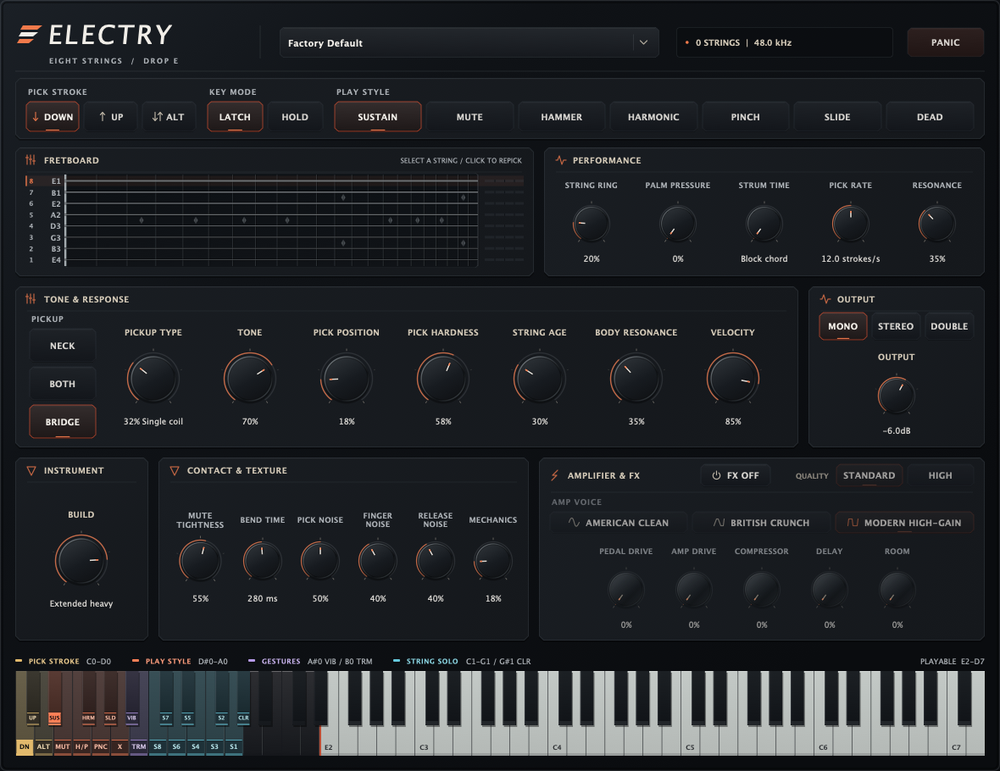

# Interface finish — 11 September 2026

Electry's existing layout now uses quieter graphite surfaces, warm platinum
lettering and restrained ember accents. The controls carry the visual emphasis:
panel outlines are softer, the chassis grain is removed, and section headings
are slightly larger with less letter spacing.

- Rotary controls have a single metal bevel, a satin face, sparse scale marks
  and a clear platinum pointer with an ember tip. Numeric values are brighter,
  with a subtle hover cue for editing.
- Selected buttons use a fine warm edge and a short indicator. Direction and
  amplifier icons are centered with their labels using measured text widths.
- The preset selector, engine status and Panic button share a common height
  and baseline. A plain gray divider replaces the short orange accent below
  the header. The status text is quieter, with its accent concentrated in
  the status light.
- The FX switch has a power symbol and a wider 84-pixel target. Bypassed
  controls retain readable labels and values with subdued surfaces. The FX
  knob row now has 12-pixel gaps between controls.
- The fretboard has quieter fret wires and clearer inlays; the playable keys
  use a softer ivory tone.

The 1180 × 910 layout retains the wide Performance panel, single-line Palm
Pressure caption, permanent keyswitch group colors and inline gray key ranges.
FX still starts off. Parameter mappings, audio processing, keyboard behavior
and accessibility semantics are unchanged.

## Review and validation

The editor test exports the real JUCE component into PNGs. The optional export
now includes 1.5× as well as 1× and 2× scales, FX enabled, a sounding performance
and simultaneous keyswitch groups. Captures are in
`build-ui-polish-20260911/`; the committed screenshot above is the final 1×
render. The test palette expectations follow the revised ember and graphite
colors while retaining the existing popup contrast and rendering checks.

VST3, AU, CLAP and Standalone build successfully on native macOS. The
processor/editor suite and all three plug-in artifact checks pass (4/4).
Existing editor checks cover control bounds, hit areas, labels, keyboard
activation, focus traversal, editable values, FX bypass states and popup
contrast. Default 1×/1.5×/2×, FX-on, active-string and keyboard-group renders
passed visual review with no clipping or overlapping controls.
